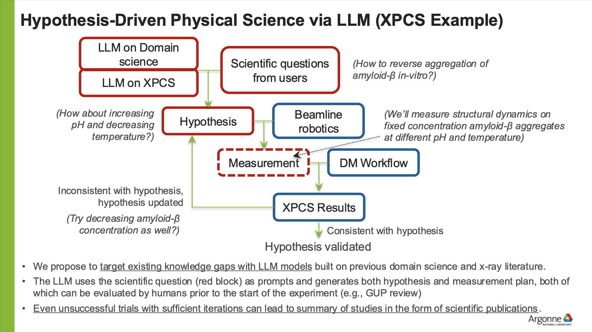

# XPCS Hypothesis Evaluator LLM (In Progress)

## Target Audience: 
* Beamline visiting users
  
## Context & Sources  
* Textbooks on XPCS  
* Data handbook   
* Sources present in the Annual Review of Materials Research (2018) citations
  
## Key Capabilities
* Assist users in formulating and refining scientific hypotheses for XPCS experiments
* Check feasibility of testing the user's hypothesis against 8-ID’s resources and capabilities
  
## Primary Goals
* Enable users to validate whether their experiment concept is technically feasible at 8-ID
* Reduce back-and-forth with beamline staff by providing upfront guidance to users

## Overall Architecture of the Desired System

## Tech Stack Plan
* Frontend: Chainlit
* Backend: FastAPI + Python
* Database: PostgreSQL, Qdrant
* RAG: LangChain, SciBERT
* LLM: Argo or AskSage
* Other: Docker or conda env
  
 

  <table border="0" style="border-collapse: separate; border-spacing: 30px;">
    <tr>
      <td align="center" style="border: none;">
        
      </td>
    </tr>
  </table>

