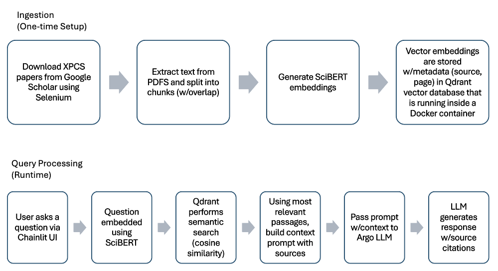
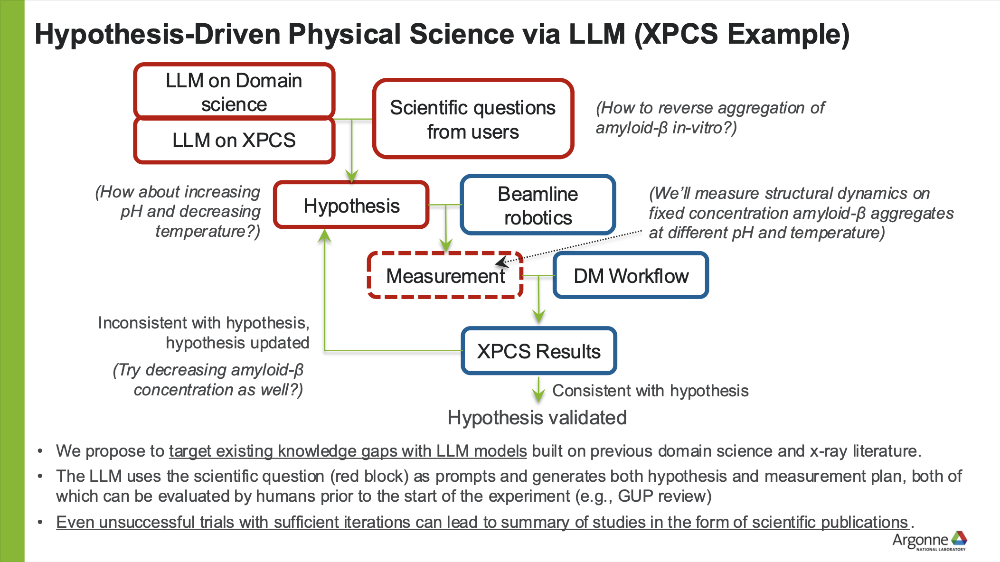
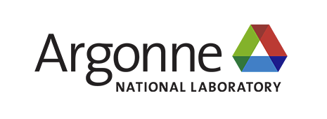

# XPCS Hypothesis Evaluator LLM (In Progress)

## Visit the Below Site to Chat with the LLM
TODO

## Target Audience: 
* Beamline visiting users
  
## Context & Sources  
* Textbooks on XPCS  
* Data handbook   
* Sources present in the Annual Review of Materials Research (2018) citations
  
## Key Capabilities
* Assist users in formulating and refining scientific hypotheses for XPCS experiments
* Check feasibility of testing the user's hypothesis against 8-ID’s resources and capabilities
  
## Primary Goals
* Enable users to validate whether their experiment concept is technically feasible at 8-ID
* Reduce back-and-forth with beamline staff by providing upfront guidance to users

## Data Flow

### Ingestion (One-time Setup)
1. Google Scholar -> 115 XPCS papers downloaded
2. PDFs loaded -> 113 successfully processed
3. Text extraction -> Split into 5,743 chunks (1000 chars, 200 overlap)
4. SciBERT embeddings -> 768-dimensional vectors generated
5. Qdrant vector database -> Vectors stored with metadata (source, page)

### Query Processing (Runtime)
1. User submits question via Chainlit UI
2. Question embedded using SciBERT
3. Qdrant performs semantic search (cosine similarity)
4. Top 7 relevant passages retrieved (threshold: TBD)
5. Context built from passages + conversation history (last 5 Q&A pairs)
6. Prompt sent to Argo API (GPT-4o)
7. LLM generates response with source citations
8. Answer displayed in Chainlit with paper names and page numbers

## Architecture of Ingestion & Query Processing

## Repository Structure
`llm-xpcs-eval/`  
|-- `context/`                    # Document acquisition  
| ---------> `download_context_docs.py`   # Selenium scraper for Google Scholar PDFs  
|-- `rag/`                        # RAG pipeline components  
| ---------> `ingest_documents.py`        # PDF -> chunks -> embeddings -> Qdrant  
| ---------> `test_retrieval.py`          # Test vector search  
|-- `app.py`                    # Main Chainlit chat interface  
|--  `config.py`                   # Hyperparameters (retrieval, LLM)  
|-- `docker-compose.yml`          # Infrastructure (Qdrant vector DB)  

## Tech Stack

**Frontend:** Chainlit (web-based chat interface)

**Backend:** Python 3.10

**Databases:** 
- Qdrant (vector database for embeddings)
- ~~PostgreSQL~~ (removed - not currently used)

**RAG Pipeline:**
- LangChain (document loading, text splitting, embedding interface)
- SciBERT (`allenai/scibert_scivocab_uncased`) - 768-dim embeddings
- Qdrant vector search (cosine similarity)

**LLM:** Argo API (GPT-4o)

**Infrastructure:**
- Docker (Qdrant container)
* Qdrant (the vector database) is running inside a Docker container
* Document embeddings are stored in a docker volume (called qdrant_data)
- Conda environment: `xpcs-llm` (Python dependencies)

## Overall Architecture of the Desired System

  
 

  <table border="0" style="border-collapse: separate; border-spacing: 30px;">
    <tr>
      <td align="center" style="border: none;">
        
      </td>
    </tr>
  </table>

