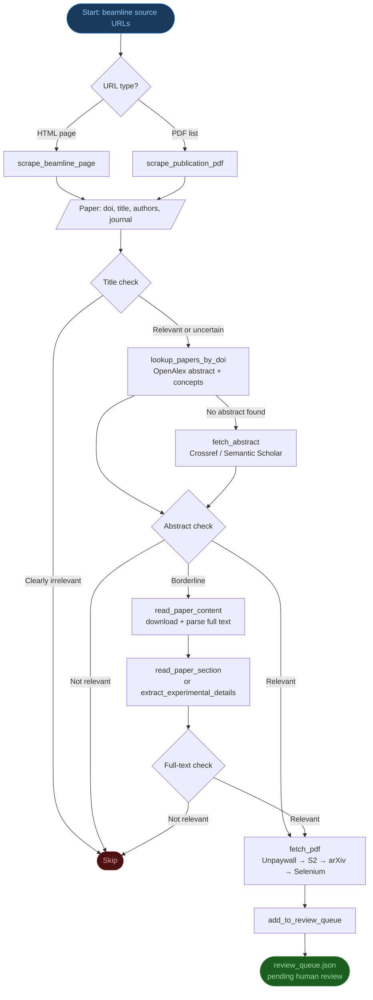

# XPCS Hypothesis Evaluator LLM

## About the Project

### Target Audience
* Beamline visiting users at Argonne National Laboratory's Advanced Photon Source (8-ID)

### Context & Sources
* XPCS textbooks and reference materials
* X-ray Data Booklet
* Papers from Annual Review of Materials Research (2018) and other XPCS literature
* Papers downloaded from DESY and ESRF publication websites

### Key Capabilities
* Assist users in formulating and refining scientific hypotheses for XPCS experiments
* Check feasibility of testing the user's hypothesis against 8-ID's resources and capabilities
* Provide cited answers grounded in the XPCS literature database

### Primary Goals
* Enable users to validate whether their experiment concept is technically feasible at 8-ID
* Reduce back-and-forth with beamline staff by providing upfront guidance

---

This project has three parts:

**Part 1 — Agentic XPCS Publication Harvester:** An agentic AI system that autonomously scouts global beamline publication pages, evaluates papers for XPCS relevance, and submits candidates to a human review queue for ingestion into the chatbot's knowledge base.

**Part 2 — RAG Chatbot:** A retrieval-augmented generation chatbot that helps beamline visiting users formulate and evaluate XPCS experiment hypotheses against 8-ID's capabilities.

**Part 3 — Document Management System:** A web-based admin panel for managing the knowledge base — adjusting document retrieval weights, uploading new PDFs, and approving or rejecting papers from the agent's review queue.

---

<h2>&nbsp;&nbsp;&nbsp;Agentic XPCS Publication Harvester</h2>

An agentic AI system that keeps the chatbot's knowledge base current by autonomously finding and screening new XPCS papers from beamline publication pages around the world.

### How It Works

The agent is built from three components working together:

- **Claude (via Argo API)** — the reasoning engine that decides what to do at each step
- **Tools** — Python functions that interact with the real world
- **Agent loop** — sends tool results back to Claude so it can decide what to do next

### Agent Flow


```mermaid
flowchart TD
    A([Start: beamline source URLs]) --> B{URL type?}

    B -->|HTML page| C[scrape_beamline_page]
    B -->|PDF list| D[scrape_publication_pdf]

    C & D --> E[/Paper: doi, title, authors, journal/]

    E --> F{Title check}
    F -->|Clearly irrelevant| SKIP([Skip])
    F -->|Relevant or uncertain| G[lookup_papers_by_doi\nOpenAlex abstract + concepts]

    G -->|No abstract found| G2[fetch_abstract\nCrossref / Semantic Scholar]
    G & G2 --> H{Abstract check}

    H -->|Not relevant| SKIP
    H -->|Relevant| I[fetch_pdf\nUnpaywall → S2 → arXiv → Selenium]
    H -->|Borderline| J[read_paper_content\ndownload + parse full text]

    J --> K[read_paper_section\nor extract_experimental_details]
    K --> H2{Full-text check}
    H2 -->|Not relevant| SKIP
    H2 -->|Relevant| I

    I --> L[add_to_review_queue]
    L --> M([review_queue.json\npending human review])

    style SKIP fill:#4a1212,color:#ef9a9a,stroke:#7f0000
    style M fill:#1b5e20,color:#a5d6a7,stroke:#2e7d32
    style A fill:#1a3a5c,color:#90caf9,stroke:#1565c0
```

### Per-Paper Workflow

For each paper discovered:

1. **Title check** — initial relevance judgment from the title alone
2. **Abstract check** — calls `lookup_papers_by_doi` (OpenAlex) or `fetch_abstract` (Crossref / Semantic Scholar)
3. **Full-text check** *(borderline papers only)* — downloads and parses the paper via `read_paper_content`, then checks the experimental section with `read_paper_section` or `extract_experimental_details`
4. **If relevant** — calls `fetch_pdf` to attempt open-access download, then `add_to_review_queue`
5. **If not relevant** — moves on

### Tools Available to Claude

| Tool | What It Does |
|------|-------------|
| `scrape_beamline_page` | Scrapes an HTML beamline publications page and extracts paper metadata |
| `scrape_publication_pdf` | Downloads a publication-list PDF and extracts DOIs and paper metadata |
| `fetch_abstract` | Retrieves a paper's abstract via Crossref or Semantic Scholar |
| `lookup_papers_by_doi` | Fetches abstract, concepts, and citation count from OpenAlex |
| `fetch_pdf` | Finds and downloads an open-access PDF (Unpaywall → Semantic Scholar → arXiv → Selenium fallback) |
| `read_paper_content` | Downloads and parses a paper by DOI into structured markdown |
| `read_paper_section` | Extracts a specific section from a previously fetched paper |
| `extract_experimental_details` | Pulls technique/material/instrument keywords from a paper's experimental section |
| `add_to_review_queue` | Writes a relevant paper to the human review queue (`agent/review_queue.json`) |

### Running the Harvester

```bash
python agent/agent.py
```

Configure target beamline URLs in the `BEAMLINE_SOURCES` list at the top of `agent/agent.py`.

---

<h2>&nbsp;&nbsp;&nbsp;RAG Chatbot</h2>

## Architecture


### Data Flow

#### Ingestion (One-time Setup)
1. PDFs loaded via `rag/ingest_documents.py`
2. Text extracted and split into chunks (1000 chars, 200 overlap)
3. SciBERT embeddings generated (768-dimensional vectors)
4. Vectors stored in Qdrant with metadata (title, authors, journal, DOI, page)

#### Query Processing (Runtime)
1. User submits question via Chainlit UI
2. Query expanded with domain-specific terms, then embedded using SciBERT
3. Three-phase retrieval:
   - **Semantic search** — top 40 results by cosine similarity
   - **Keyword scroll** — chunks containing all extracted key terms
   - **Adjacent chunk retrieval** — neighboring pages from already-retrieved documents
4. Results sorted by document weight (admin-configurable), then similarity
5. LLM reranker (GPT-4.1 Nano) filters to contextually relevant chunks
6. Claude Opus 4.1 generates a cited response from filtered passages
7. Answer displayed in Chainlit with clickable source citations (side panel shows chunk text and metadata)

### Authentication

Login uses ANL LDAP credentials. Configure via `.env`:

```
LDAP_SERVER=...
LDAP_BASE_DN=...
LDAP_SERVICE_USER_DN=...
LDAP_ADMIN_PASSWORD=...
```

### Running the Chatbot

```bash
chainlit run app.py
```

---

<h2>&nbsp;&nbsp;&nbsp;Document Management System</h2>

A FastAPI admin panel (port 8001) that launches automatically alongside the chatbot. Accessible via a link in the chat welcome message — authenticated via a per-session token.

### Document Weights Tab

Controls how aggressively each document is cited in answers:

- **Weight 0–29:** cited only if directly and specifically relevant
- **Weight 30–69:** cited only if clearly relevant
- **Weight 70–100:** cited if possibly relevant
- **Weight 0:** excluded entirely from retrieval

Supports uploading new PDFs directly from the browser. CrossRef is queried automatically for metadata; if not found, a manual entry form is shown. Uploaded documents are chunked, embedded, and added to Qdrant immediately.

### Review Queue Tab

Shows papers submitted by the harvesting agent. For each paper:
- View title, authors, journal, DOI, agent confidence, and abstract
- **Approve** — ingests the paper (full PDF text if downloaded, otherwise abstract) into Qdrant
- **Deny** — marks as rejected

---

## Repository Structure

```
llm-xpcs-eval/
├── app.py                   # Chainlit chat interface (main entry point)
├── config.py                # LLM, retrieval, and reranker hyperparameters
├── logger.py                # Query and access logging
├── auth_tokens.py           # Admin session token management
├── doc_weights.json         # Per-document weight store
├── agent/
│   ├── agent.py             # Harvesting agent + tool implementations
│   └── review_queue.json    # Papers pending human review
├── admin/
│   ├── admin.py             # FastAPI admin panel (weights + review queue)
│   └── weights_manager.py   # Weight load/save/apply helpers
├── rag/
│   ├── ingest_documents.py  # PDF → chunks → embeddings → Qdrant
│   ├── ingest_reference_docs.py
│   ├── reingest_everything.py
│   ├── citations/           # Metadata audit and repair scripts
│   └── add_handbook/        # Scripts for adding reference documents
├── context/
│   └── download_context_docs.py  # Selenium scraper for Google Scholar PDFs
└── public/                  # Chainlit static assets (CSS, JS, logos)
```

## Tech Stack

**Frontend:** [Chainlit](https://github.com/Chainlit/chainlit) — conversational AI interface  
**Admin UI:** FastAPI + server-rendered HTML (port 8001)  
**Auth:** ANL LDAP  
**Backend:** Python 3.10+

**LLM:** Claude Opus 4.1 (`claudeopus41`) via Argo API  
**Reranker:** GPT-4.1 Nano (`gpt41nano`) via Argo API  

**Embeddings:** SciBERT (`allenai/scibert_scivocab_uncased`) — 768-dimensional vectors  
**Vector Database:** Qdrant (local)  
**RAG Pipeline:** LangChain (document loading, text splitting, embedding interface)

**Agent Tools:** Crossref, Semantic Scholar, OpenAlex, Unpaywall, arXiv, Selenium

## Overall Architecture


<br>

<div align="center">
  <table border="0" style="border-collapse: separate; border-spacing: 30px;">
    <tr>
      <td align="center" style="border: none;">
        
      </td>
    </tr>
  </table>
</div>
